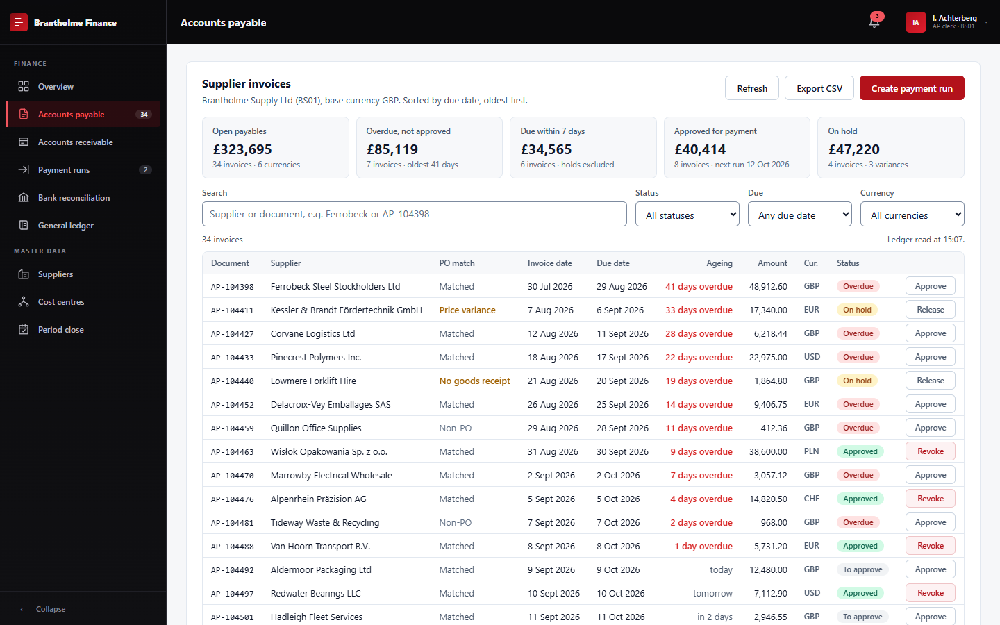
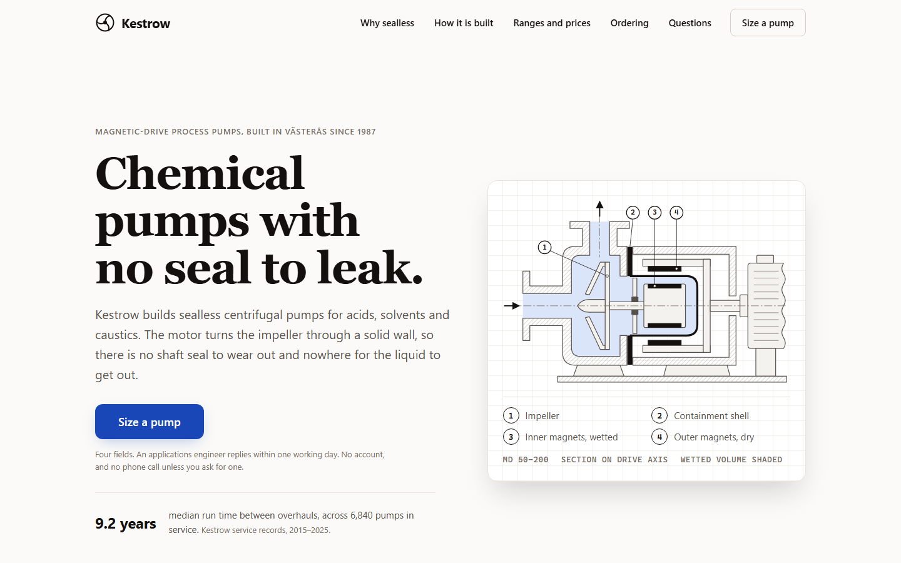
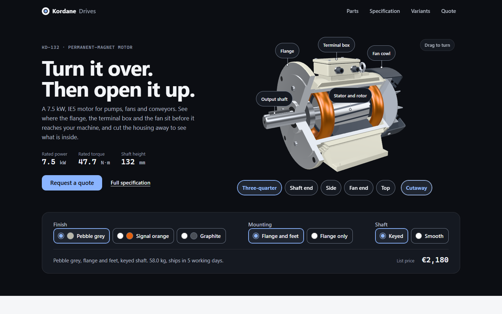
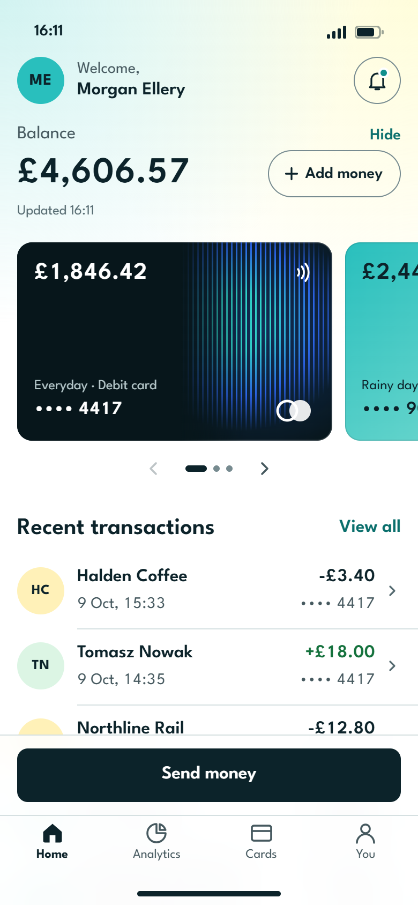

# UI Design Ecosystem

**Domain-specific UI design systems, packaged as skills for Claude, Gemini and GPT.**

[](LICENSE)
<!-- PACKS:START:badge-en -->
[](#the-packs)
<!-- PACKS:END:badge-en -->
[](docs/ARCHITECTURE.md)

🌐 **[English](README.md)** · [Tiếng Việt](docs/README.vi.md)

---

Ask an AI assistant for an admin panel and you usually get a consumer SaaS
dashboard: airy spacing, pastel cards, a colour for every module. Ask it for a
landing page and you often get the same thing. The output converges because the
assistant has no position on what *kind* of interface it is building.

This repo gives it one. Each **pack** is a design system for a specific domain,
carrying a thesis another domain would reject — plus the tokens, measurements
and reasoning to act on it.

## What it produces

Four requests, four packs. Each page below was built by an assistant working
only from the generated skill in [`dist/`](dist/) — plain HTML, CSS and
JavaScript, no framework, no build step.

<table>
<tr>
<td width="50%" valign="top">
<a href="demos/erp-finance/"></a>
<br><b><code>erp</code></b> — an accounts-payable workbench. Thirty-four invoices, twenty on screen at 1080p, one action per row.
</td>
<td width="50%" valign="top">
<a href="demos/consumer-manufacturer/"></a>
<br><b><code>consumer-web</code></b> — a pump manufacturer's home page. One headline, one primary action, a drawing instead of a stock photo.
</td>
</tr>
<tr>
<td width="50%" valign="top">
<a href="demos/immersive-manufacturer/"></a>
<br><b><code>immersive-web</code></b> — a motor the visitor can turn over and cut open, with a poster behind it for when WebGL is not there.
</td>
<td width="50%" valign="top" align="center">
<a href="demos/mobile-finance/"></a>
<br><b><code>mobile-app</code></b> — a banking app's home screen. Rows, not cards; the primary action where the thumb is.
</td>
</tr>
</table>

Same repo, same core rules, and almost no decision in common — which is the
point. Every company, name and figure in them is invented. Sources, how to open
each one, and what was not verified are in [`demos/`](demos/).

## Point your agent at it

Tell your assistant to read this, and it will pick the pack that fits and
install it:

```
https://raw.githubusercontent.com/DMonkey0908/ui-design-ecosystem/main/INSTALL.md
```

[`INSTALL.md`](INSTALL.md) is written for an agent: identify the project type
first, match against the catalogue's exclusion signals, install exactly one
pack, wire it to fire on its own, and report what changed and how to undo it.
There is a machine-readable catalogue at [`dist/index.json`](dist/index.json)
and an [`llms.txt`](llms.txt) index at the root.

### Small in context, full on disk

A repository install is a **lean layout**: a short entry file - `GEMINI.md`,
`AGENTS.md` or a Claude `SKILL.md` - with the references beside it. The entry
holds the activation block, the thesis, the hard rules and an index; the
assistant opens the one reference its task needs.

<!-- COST:START:en -->
| Install | Always in context |
|---|---|
| Claude skill | ~200 tokens (the description, for routing) |
| Lean `GEMINI.md` / `AGENTS.md` | ~2,350 tokens |
| Single merged file (Gems, Custom GPT) | ~35,300 tokens |

Roughly a 93% reduction against pasting the whole system into a context
file, on every request, including the ones with nothing to do with UI.
<!-- COST:END:en -->

### It fires without being asked

Installing is meant to be the last time anyone thinks about it. Ask for a
screen, or for a table to look better, and the system applies itself.

| Tool | Trigger | Deterministic? |
|---|---|---|
| Cursor | `.cursor/rules/*.mdc`, attached by file glob | **Yes** |
| GitHub Copilot | `.github/instructions/*.instructions.md`, `applyTo` globs | **Yes** |
| Claude Code / Desktop | skill `description`, selected per task | No — a judgement call |
| Gemini, Codex, Custom GPT | in context on every request | Always loaded, applied by judgement |

Every build opens with an [activation block](core/ACTIVATION.md): when it
applies, what to do before the first line of code, and what never to do
whatever the request. That block is what turns a reference document into a
reflex — without it an assistant has the rules available, writes UI the way it
always has, and cites them afterwards if challenged.

Being honest about the limit: only the glob-driven tools are deterministic.
Everywhere else this raises the odds substantially and does not guarantee.
`INSTALL.md` has a test to confirm it actually fires in your setup.

### Or install it only for as long as the work lasts

An install can be temporary: in for the job, removed when the user says the UI
work is finished. Set `"lifecycle": "remove-after-task"` in the install
manifest and the assistant tears it down on confirmation, deleting only what it
created and only between its own markers.

Worth knowing what it saves before turning it on. Idle cost per request:

| Format | Idle cost | Worth removing? |
|---|---|---|
| Claude skill | ~200 tokens (only the `description`, for routing) | No — a rounding error, and you lose automatic activation |
| Cursor / Copilot rule | 0 until a matching file is opened | No — already conditional |
| Lean `GEMINI.md` / `AGENTS.md` | the lean figure above | Rarely |
| Merged single file | the merged figure above, every request | Yes — but prefer the lean layout instead |

Mostly this is now moot, because the lean layout removed the cost it was
solving. [`INSTALL.md`](INSTALL.md) step 6 has the manifest format and the
rules for removing safely — chiefly: never remove what you did not install, and
never treat a passing build as the user saying they are done.

## The packs

<!-- PACKS:START:en -->
| Pack | Domain | Status |
|---|---|---|
| [`consumer-web`](packs/consumer-web/) | **Consumer web** - Public-facing sites read by strangers: marketing pages, landing pages, product sites, documentation and editorial. | `beta` |
| [`erp`](packs/erp/) | **ERP & back-office** - Dense, dark-chrome operational software: admin panels, operations consoles, back-office tools, internal dashboards. | `stable` |
| [`immersive-web`](packs/immersive-web/) | **Immersive web** - Public pages built around one real-time 3D scene the visitor can drive: product viewers and configurators, a 3D hero for a company site, a spatial subject taught in the browser - with three.js, React Three Fiber or model-viewer. | `draft` |
| [`mobile-app`](packs/mobile-app/) | **Mobile app** - Installed apps held in one hand: iOS and Android, native or cross-platform, used in short interrupted sessions. | `beta` |
<!-- PACKS:END:en -->

Planned, in rough order: AI product surfaces, fintech, e-commerce, SaaS
dashboard. See [`docs/AUTHORING.md`](docs/AUTHORING.md) to add one, and
[`docs/RESEARCH.md`](docs/RESEARCH.md) for where the evidence comes from.

These disagree on purpose. `erp` optimises for the two-hundredth use by a
trained operator; `consumer-web` optimises for the first five seconds for a
stranger who owes you nothing; `mobile-app` optimises for one thumb on a screen
that will be interrupted; `immersive-web` spends several times a normal page's
budget on one 3D scene the visitor can steer. Nearly every concrete decision inverts — density,
whether a card is the default container, whether a border or space does the
separating, whether the primary action belongs at the top of the screen or the
bottom. That is what a pack is: a thesis another domain would reject. If two
packs agree, one of them is core.

## Install

Everything installable lives in [`dist/`](dist/), generated and committed — you
never need to run Node to use this.

<details open>
<summary><b>Claude Code / Claude Desktop</b> — the richest build</summary>

```bash
cp -r ./dist/claude/erp-ui-design ~/.claude/skills/erp-ui-design       # all projects
cp -r ./dist/claude/erp-ui-design <project>/.claude/skills/            # one project
```

```powershell
Copy-Item -Recurse ".\dist\claude\erp-ui-design" "$HOME\.claude\skills\erp-ui-design"
```

Claude invokes it on its own for relevant work, or by hand with
`/erp-ui-design`. This build carries the most detail: Claude reads `SKILL.md`
first and loads a reference only when the task needs it, so the references can
afford depth a single flat file could not.
</details>

<details>
<summary><b>Gemini</b> (CLI, Code Assist, Gems)</summary>

```bash
cp ./dist/gemini/erp.GEMINI.md ~/.gemini/GEMINI.md      # global
cp ./dist/gemini/erp.GEMINI.md <project>/GEMINI.md      # per project
```

For a **Gem**, paste the whole file into the Instructions field.
</details>

<details>
<summary><b>GPT</b> (Codex, Cursor, Custom GPT)</summary>

```bash
cp ./dist/gpt/erp.AGENTS.md <project>/AGENTS.md
```

If the project already has an `AGENTS.md`, merge its sections under a `## UI`
heading.

For a **Custom GPT**: paste the fenced block from
[`dist/gpt/erp.custom-gpt-instructions.md`](dist/gpt/erp.custom-gpt-instructions.md)
into the **Instructions** field, and upload
[`dist/gpt/erp.AGENTS.md`](dist/gpt/erp.AGENTS.md) as a **Knowledge** file.

That split is deliberate. The 8000-character Instructions field holds the
*judgement* — what the system is for, what it refuses, the rules a model
misremembers. The Knowledge file holds the *exact values*. A model paraphrasing
a spacing scale from memory produces something almost right, which is worse than
obviously wrong, so the instructions tell it to quote rather than recall.
</details>

## How it is built

```
core/            rules true for EVERY interface  ─┐
packs/<id>/      what ONE domain decided          ├─→ tools/build.mjs ─→ dist/
                                                  ─┘
```

Eight domains times three assistant formats would be twenty-four hand-maintained
documents, most of them identical, drifting apart silently. So each pack is
authored once — core rules plus a domain overlay — and every format is
generated.

**Core holds method, never values.** "An accent needs one value per surface" is
core; `#b3121b` is not. The build enforces this: a concrete colour in a core
prose paragraph fails the build.

**A pack never repeats a core rule.** It points at it and adds the domain
consequence. A pack may *override* a core rule if it declares the override and
defends it — silent contradiction is the thing that kills a system like this.

```bash
npm run build     # regenerate dist/
npm run check     # validate + verify dist/ is current (what CI runs)
```

Full reasoning, and the decisions still open, in
[`docs/ARCHITECTURE.md`](docs/ARCHITECTURE.md).

## What core enforces, whatever you are building

Roughly a hundred rules across tokens, typography, layout, motion, feedback,
input, accessibility, i18n, charts, visual language and review — each with its
consequence attached. A sample:

- **Every accent needs one value per surface.** A brand colour chosen to read on
  white disappears on near-black. The commonest bug in a dark-chrome UI is an
  active nav item painted in the light-surface accent — on brand, invisible.
- **`font-variant-numeric: tabular-nums` on every figure.** Proportional digits
  make a column of numbers ripple as it refreshes. Highest value-per-character
  line in the system.
- **`min-width: 0` on grid children.** The default is `min-width: auto`, so one
  wide table stretches its track and pushes navigation off screen.
- **Restore state before first paint.** A collapsed sidebar or a chosen language
  applied after paint means the user watches the layout correct itself on every
  navigation.
- **`opacity: revert` under `prefers-reduced-motion` does not restore your
  value.** It rolls back to the browser default of `1`.
- **Start a value axis at zero where magnitude is compared.** A truncated axis
  outlives the conversation that would have qualified it.
- **The clock picks the waiting affordance.** A spinner that appears and
  vanishes inside 300ms reads as a stutter in an interface that was fast; one
  still spinning after a second should have been a skeleton.
- **Nothing lives behind hover alone.** On a touchscreen a hover-only row action
  is not awkward to reach, it does not exist.
- **In a dark theme, depth is luminance.** A shadow has nothing left to darken,
  so every layer collapses onto the same plane.

## What this is not

Not a component library. No React files, nothing to `npm install` as a
dependency, no Tailwind config. It is a **specification** — tokens,
measurements, reasoning — so an assistant generates matching code in whatever
framework you use.

The trade: it never drifts out of sync with a runtime, and it works for plain
HTML as readily as for React.

## On the content

Every token, measurement and snippet in the `erp` pack was read out of shipping
code, not invented. The failure modes are equally real — each one happened,
including the palette drift in the source system's own older pages. A guide that
documents only the polished parts will not help anyone avoid the trap that
already sprang.

The packaging now has one data point of its own.
[`evals/`](evals/) holds a complete screen built from the generated `erp` skill
and nothing else, scored against both checklists: 52 of 53 applicable core items
and 27 of 27 pack items, with nine findings — including three places where a
pack's own files contradicted each other, invisible until somebody tried to
follow both.

That run was administered by the model that had just edited the rules, so it
says the answers are in the build. It does not say a cold assistant goes looking
for them. Until a fresh session runs one, treat activation as the part still
unverified.

## Contributing

Issues and pull requests welcome, in English or Vietnamese.

The bar for a new rule is a **reason**, not a preference — if you can describe
what breaks without it, ideally something you watched break, it belongs here.
The bar for a new pack is a **thesis another domain would reject**; see
[`docs/AUTHORING.md`](docs/AUTHORING.md).

Edit `core/` or `packs/`, never `dist/`. Run `npm run build` and commit the
result; CI fails a pull request whose `dist/` is stale.

## License

MIT — see [LICENSE](LICENSE). Use it, change it, redistribute it, including
commercially; keep the copyright line.
